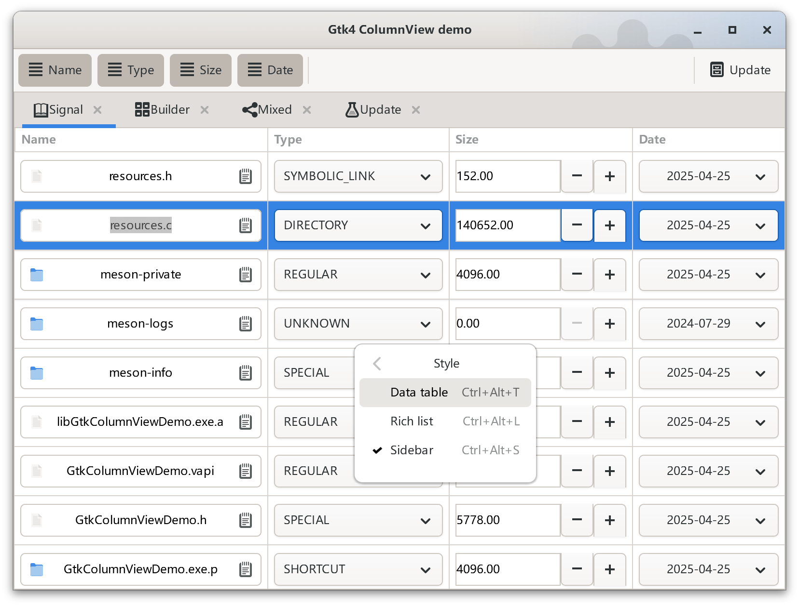
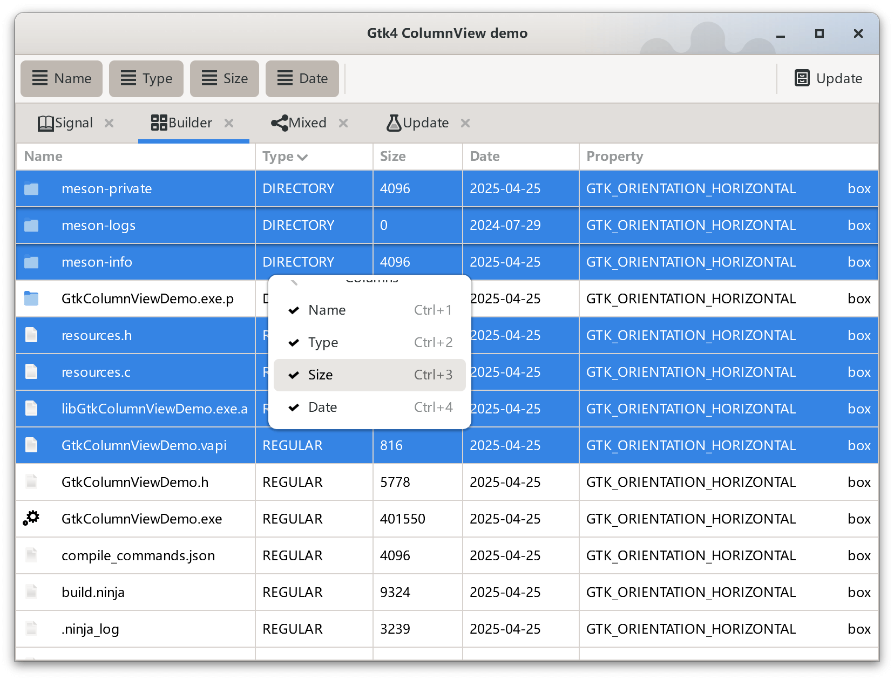

# GtkColumnViewDemo
This is a GtkColumnView demo app for validating the GTK4 features for [Kangaroo App](https://www.datatable.online/?from=github), that is a database client and admin tool built with GTK, libgda and Vala.

The GtkColumnViewDemo app integrates with following GTK4 features:
1. GtkColumnView / GtkColumnViewColumn
2. GtkPopoverMenu with checkmark
3. Context menu with model and submenu support
4. GtkNotebook with a custom tab widget
5. GtkBuilder with GtkTemplate / GtkChild / GtkCallback support
6. GtkBuilderListItemFactory with resource and bytes support
7. GtkSignalListItemFactory
8. Shortcut register and handle
9. GtkMenuButton/GtkSpinButton/GtkEntry/GtkPopover/GtkDropDown/... usage
10. GtkExpression usage
11. MessageDialog with default button and css style
12. Toolbar with dynamic binding support
13. Add MSYS2 based VSCode debug support

# Screenshot



# Expression examples
__Expression with GtkClosureExpression(global) + GtkPropertyExpression__
string get_file_type_factory (Gtk.ListItem item, FileInfo? info);
```xml
<object class="GtkLabel">
  <binding name="label">
    <closure type="gchararray" function="get_file_type_factory">
      <lookup name="item">GtkListItem</lookup>
    </closure>
  </binding>
</object>
```
__Expression with GtkPropertyExpression + GtkPropertyExpression__
```xml
<object class="GtkLabel">
  <binding name="label">
    <lookup type='GtkWidget' name="css_name">
      <lookup name="child">GtkListItem</lookup>
    </lookup>
  </binding>
</object>
```

__Expression with GtkExpression property + GtkConstantExpression__
```xml
<property name="sorter">
  <object class="GtkNumericSorter" id="sorter_css">
    <property name="expression">
      <constant type='gint64'>100</constant>
    </property>
    <property name="sort-order">GTK_SORT_ASCENDING</property>
  </object>
</property>
```

__Expression with GtkExpression property + GtkClosureExpression(global)__
```xml
<object class="AdwComboRow" id="alignment">
  <property name="visible">True</property>
  <property name="focusable">False</property>
  <property name="enable-search">True</property>
  <property name="title" translatable="yes">Alignment</property>
  <property name="model">
    <object class="AdwEnumListModel">
      <property name="enum-type">GtkAlign</property>
    </object>
  </property>
  <property name="expression">
    <closure type="gchararray" function="get_enum_short_name"/>
  </property>
</object>
```